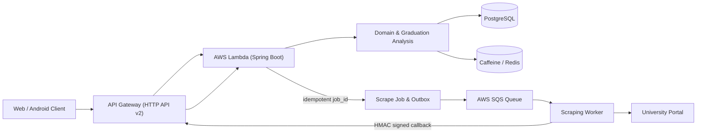

# 척척학사 Backend

  

---

## 📚 목차

1. [프로젝트 소개](#프로젝트-소개)
2. [주요 기능](#주요-기능)
3. [API 문서](#api-문서)
4. [기술 스택](#기술-스택)
5. [아키텍처](#아키텍처)
6. [ERD](#erd)
7. [개발 문서](#개발-문서)
8. [관련 블로그 게시글](#관련-블로그-게시글)

---

## 프로젝트 소개

**척척학사**는 학생들이 학교 포털과 연동하여 본인의 이수 현황과 졸업 요건을 손쉽게 확인하고 관리할 수 있도록 도와주는 서비스입니다.

> 기존에는 학생들이 졸업 요건을 직접 확인하며 수작업으로 비교해야 했지만,  
> 척척학사는 이를 **학교 포털과 비동기 연동**, **자동 분석**, **시각적 안내** 기능으로 효율화합니다.

- ✅ **6,000명 이상** 수원대 재학생 사용 중
- 🔁 **학교 포털과 비동기 연동 + job_id 상태 조회**
- 🧠 **졸업 요건 자동 분석 및 부족 항목 안내**

---

## 주요 기능

  
   
  
   
  

- 포털 연동을 통한 학점·성적·커리큘럼 비동기 동기화
- 졸업 요건과 사용자 학사 정보 자동 비교
- 부족한 학점 및 조건 자동 분석 및 안내
- job_id 기반 비동기 파이프라인: 요청 접수 -> Outbox 패턴으로 SQS에 발행 -> 비동기 처리 후 결과 반영

---

## API 문서

👉 [Swagger API 문서 보기](https://api.cchaksa.com/swagger-ui/index.html?cache=false)

---

## 배포 환경 변수 (OIDC)

- `APP_KEY`: 카카오 OIDC `aud` 검증에 사용하는 기본 키(REST API 키)
- `APP_NATIVE_KEY`: 안드로이드 OIDC `aud` 검증에 사용하는 네이티브 앱 키 (선택)

> GitHub Actions 배포 시 `dev/prod` 저장소 secrets에 `APP_NATIVE_KEY`를 함께 등록해야 합니다.

---

## 기술 스택

### Back-end
- Java 17
- Spring Boot 3.2.5
- Spring Security, OAuth2
- JPA, Hibernate

### Infra
- AWS API Gateway (HTTP API v2) + AWS Lambda (Spring Boot) + Route53/ACM
- AWS SQS + HMAC Callback 파이프라인 (스크래핑 워커 연동)
- PostgreSQL (Supabase 연동) + Caffeine / Redis 캐시
- Observability: Sentry, Grafana Cloud(OTLP), CloudWatch Logs
- Docker 기반 Lambda 패키징 및 GitHub Actions 배포

### Tools
- Git, GitHub
- Swagger (OpenAPI)
- Gradle, Tomcat

---

## 아키텍처

1. 사용자는 `Idempotency-Key`와 함께 비동기 포털 연동을 요청하고, Lambda는 job_id와 polling endpoint를 즉시 반환합니다.
2. 스크래핑 요청은 Scrape Job Outbox -> AWS SQS -> 전용 워커 -> 학교 포털 순으로 전달되어 병목을 분리합니다.
3. 워커는 HMAC 서명된 callback을 API Gateway로 보내고, Lambda는 이를 처리해 졸업 요건 데이터/캐시를 갱신한 뒤 상태/요약 API에 반영합니다.

---

## 핵심 로직 및 흐름

척척학사의 핵심 기능인 **포털 동기화**, **데이터 적재**, **졸업 요건 분석** 프로세스에 대한 시퀀스 다이어그램입니다.

<b>1. 포털 동기화 시퀀스 (Click)</b>

  

<b>2. 학업 데이터 적재 및 매핑 흐름 (Click)</b>

  

<b>3. 졸업 요건 조회 및 캐싱 흐름 (Click)</b>

  

---

## ERD

  

---

## 개발 문서

- [`CONTRIBUTING.md`](CONTRIBUTING.md): 사람용 이슈·브랜치·릴리즈·커밋·PR 규칙.
- [`docs/development/java-style.md`](docs/development/java-style.md): Java 포맷, Checkstyle, Javadoc 기준과 검증 명령.
- [`docs/tasks/README.md`](docs/tasks/README.md): 이슈별 설계·구현 계획 문서 작성 기준.
- [Backend Wiki](https://github.com/cchaksa/cchaksa-backend/wiki): 로컬 실행, 아키텍처, API·인증, 배포, 운영, 트러블슈팅.
- [Development Guide](https://github.com/cchaksa/cchaksa-backend/wiki/Development-Guide): 브랜치, 커밋, 테스트, PR, Wiki 갱신 절차.
- [Architecture Decision Records](https://github.com/cchaksa/cchaksa-backend/wiki/Architecture-Decision-Records): 주요 기술 결정과 재검토 조건.

README는 프로젝트 진입점입니다. 사람용 협업 규칙은 [`CONTRIBUTING.md`](CONTRIBUTING.md), 개발·운영 상세 가이드와 ADR은 Wiki, AI Agent 실행 규칙은 [`AGENTS.md`](AGENTS.md)에서 관리합니다.

---

## 관련 블로그 게시글

👉 [척척학사 블로그 시리즈 전체보기](https://velog.io/@pp8817/series/척척학사)

<b>성능 최적화 & 트러블슈팅</b>

- [척척학사 포털 연동 과정 16초를 0.8초로 94.8% 개선한 과정](https://velog.io/@pp8817/척척학사-포털-연동-과정-16초를-0.8초로-94.8-개선한-과정)
- [트래픽 피크형 서비스의 운영 구조를 요청 기반 구조로 바꾼 과정](https://velog.io/@pp8817/트래픽-피크형-서비스의-운영-구조를-요청-기반-구조로-바꾼-과정)
- [ API 성능 튜닝: P6Spy 쿼리 분석부터 인덱싱 & 캐싱까지](https://velog.io/@pp8817/척척학사-API-성능-튜닝)
- [크롤링 로직 비동기 처리 대신 Redis 캐싱 도입한 이유](https://velog.io/@pp8817/척척학사-크롤링-로직-비동기-처리-대신-Redis-캐싱을-도입한-이유)
- [포털 데이터 Redis 캐싱 전략 도입기](https://velog.io/@pp8817/척척학사-포털-데이터-Redis-캐싱-전략-도입기)
- [부하테스트 (1) t3.micro 서버의 한계 측정](https://velog.io/@pp8817/척척학사-t3.micro-서버의-한계-측정-7-TPS는-버티고-10-TPS는-왜-무너졌나)
- [부하 테스트 (2) Redis vs Local Cache](https://velog.io/@pp8817/척척학사-Redis-vs-Local-Cache-t3.micro에서-캐시는-어디까지-의미가-있을까)
- [부하 테스트 (3) 7 TPS에서 96 TPS까지 — 병목을 제거하며 t3.micro의 한계를 밀어본 기록](https://velog.io/@pp8817/척척학사-인증-필터-캐시-적용으로-병목은-사라졌을까)

<b>아키텍처 & 인프라</b>

- [척척학사 AWS EC2 주기적 사망 원인 분석](https://velog.io/@pp8817/척척학사-AWS-EC2-주기적-사망-원인-분석)
- [척척학사 Lambda 서버리스 전환 후 처리량 한계 분석](https://velog.io/@pp8817/척척학사-Lambda-서버리스-전환-후-처리량-한계-분석)
- [Next.js 기반 서버를 Spring으로 갈아엎은 이유](https://velog.io/@pp8817/척척학사-Next.js-Spring-Boot-백엔드-마이그레이션-회고)
- [ELK의 오버엔지니어링을 걷어내고: Grafana Loki와 Sentry로 로그 스택 재설계하기](https://velog.io/@pp8817/척척학사-로그-시스템-리빌드-ELK-Grafana-Loki)
- [CI/CD 적용 과정 With GitHub Actions](https://velog.io/@pp8817/척척학사-GitHub-Actions-적용)
- [트래픽이 몰리는 서비스는 어떻게 버텨야 할까: 서버 장애 대응](https://velog.io/@pp8817/척척학사-트래픽이-몰리는-서비스는-어떻게-버텨야-할까-서버-장애-대응)
- [디스크 용량 부족으로 인한 JVM 실행 실패 해결기](https://velog.io/@pp8817/척척학사-디스크-용량-부족-문제)
- [Terraform으로 AWS 계정 간 인프라를 재현 가능하게 만들기](https://velog.io/@pp8817/DevOps-Terraform으로-AWS-계정-간-인프라를-재현-가능하게-만들기)

<b>기능 구현 & 설계</b>

- [Supabase를 알아보자 With Java, Spring](https://velog.io/@pp8817/DB-Supabase를-알아보자-With-Java-Spring)
- [OIDC 인증, 인가 처리 With Kakao 소셜 로그인](https://velog.io/@pp8817/척척학사-OIDC-인증-인가-처리-With-Kakao-소셜-로그인)
- [Entity 연관관계 분석 및 리팩토링](https://velog.io/@pp8817/척척학사-Entity-연관관계-분석-및-리팩토링)
- [API 응답 모듈 분리 과정](https://velog.io/@pp8817/척척학사-API-응답-모듈-분리-과정)
- [복수전공생도 사용할 수 있게 만들기](https://velog.io/@pp8817/척척학사-복수전공생도-사용할-수-있게-만들기)
- [소셜 로그인 정보 변경으로 인한 중복 계정 생성 문제 해결](https://velog.io/@pp8817/척척학사-소셜-로그인-시-email-변경-또는-Provider-변경-시-발생하는-중복-계정-문제-해결기)
- [PostgreSQL Unique Constraint 에러 해결하기](https://velog.io/@pp8817/척척학사-PostgreSQL-duplicate-key-value-violates-unique-constraint-에러-해결하기)
- [포털 연동 시 이수 구분 오류 & 재수강 중복 문제 해결](https://velog.io/@pp8817/척척학사-트러블슈팅-포털-연동-시-이수-구분-오류-재수강-중복-문제-해결)
- [복잡한 졸업 요건 검증 로직: 거대 SQL(CTE)에서 애플리케이션 조합으로의 전환](https://velog.io/@pp8817/God-Query-해체-분석-척척학사)

